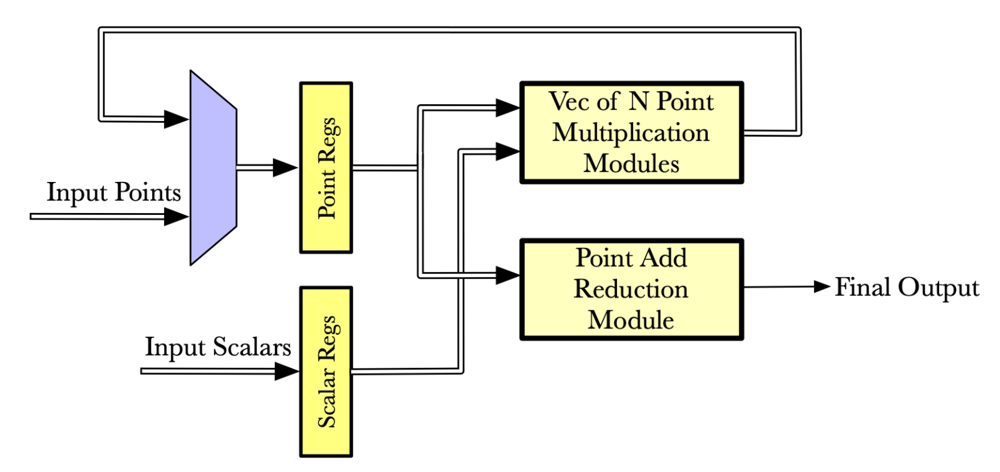

# Multi-Scalar Multiplication in Chisel

This is a Chisel Module that performs Multi-Scalar Multiplication over Elliptic Curves. This is also my (Connor Masterson) Undergraduate Thesis Project. Feel free to clone it, try running it, or make improvements.

As of right now (3-25-22) this is still very much a work in progress. A thesis also requires a lot of writing so I'm working on getting that finalized right now. I can link the paper here when everything is finalized. This project is part of a larger effort to make Verifiable Computing accelerators at UCSC and in the future, this module and others like it can be found [here.](https://github.com/ucsc-vama)

Below is a brief description of what modules are in this design. However, more detailed explanations can be found in Chapter 3 of my thesis, which is in the top level directory of this repo.

### Let's go over what modules are here (top down):
* **Top Level MSM**: Main MSM module. Takes in vectors of EC points and Scalars and computes a dot product between them resulting in a single EC Point. This module has a parameter called numPMmodules which determines how many EC Point Multiplcation modules get instantiated. This number is also the number of Scalars and EC Points should be streamed in at a time. This block is controlled by a state machine with three states: idle, multiplying, reduction. When the input load signal goes high, we transition to the multiply state. Here, the numPMmodules many Point Mult modules perform one multiplcation each. As they complete, their results are latched into regs. When they are all complete, we transition to the reduction state. Here, a Point Reduction module performs and addition reduction on the points to get one final point. When the valid signal of the Point Reduction module is asserted, the Top Level MSM valid signal can also be asserted and the multiplication can be considered complete. It should be noted that normal ZKP's require thousands or even millions of multiplications. It would not be practical to have a million Point Mult modules instantiated in this module. Instead it is assumed that the numPMmodule scalars and point will be predictably streamed in when needed. The result of this module is only a partial result. The host system can then perform its accumulation of these partial results while the module works on the next set of multiplcations. A block diagram for this module can be seen below.

* **Point Add Reduction**: This module performs an addition reduction on a set of EC Points. It has one parameter that determines how many EC points it will take in at a time. To perform the reduction, it instantiates one Point Addition module and continually performs additions until a sum is achieved.

* **Point Multiplication**: This module calculates EC Point Multiplication by instantiating a Point Addition module and performing repeated additions until a sum is achieved. e.g. to compute 8 * (2,4), the module will perform (2,4) + (2,4) + ... + (2,4). This could be improved with the double and add method but that is still not functional at this time and is explained in more detail in the Future Work section of the thesis.

* **Point Addition**: This module calculates Elliptic Curve Point Addition with affine (x and y) coordinates. To do this, it must instantiate a Modular Inverse module. EC Point addition is not as simple as adding the x and y coordinates together. EC Points must exhibit closure. More information on how EC Point addition works can be found here: https://crypto.stanford.edu/pbc/notes/elliptic/explicit.html 

### Future Work
This design still needs significant work before it can be considered feasible or even useful. Current work provides a good structure but leaves much to be desired. First and foremost, it must be converted to use projective coordinates. The current implementations affine coordinates require a mod inverse calculation which is costly. Projective coordinates don't require this calculation. Second, much more work can be done to help with load balancing. 
